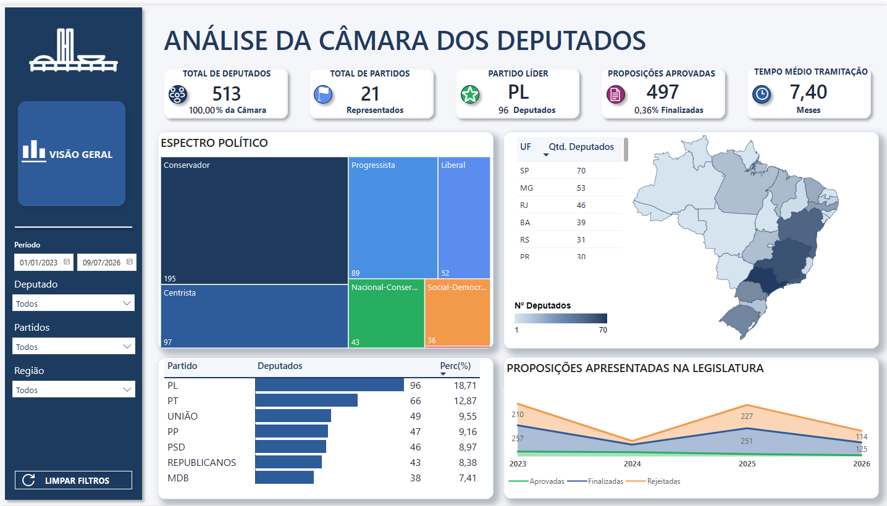

# Pipeline Lakehouse de Dados Abertos da Câmara dos Deputados


Projeto de Engenharia de Dados que transforma dados públicos da Câmara dos Deputados em um produto analítico estruturado para exploração em Power BI.

O pipeline cobre ingestão via API, tratamento com PySpark, arquitetura medalhão, armazenamento em Delta Lake, classificação textual com ML/NLP, modelagem dimensional em Star Schema e publicação de tabelas para consumo analítico.

---

## Sumário

- [Visão Geral](#visão-geral)
- [Problema de Negócio](#problema-de-negócio)
- [Arquitetura](#arquitetura)
- [Tecnologias Utilizadas](#tecnologias-utilizadas)
- [Resultados do Projeto](#resultados-do-projeto)
- [Dashboard Power BI](#dashboard-power-bi)
- [Competências Demonstradas](#competências-demonstradas)
- [Estrutura do Projeto](#estrutura-do-projeto)
- [Como Executar](#como-executar)
- [Documentação Técnica](#documentação-técnica)
- [Evoluções Futuras](#evoluções-futuras)
- [Fonte dos Dados](#fonte-dos-dados)

---

## Visão Geral

Este projeto simula um pipeline moderno de dados legislativos, com foco em boas práticas de Engenharia de Dados para portfólio.

O objetivo é demonstrar uma solução ponta a ponta, desde a coleta dos dados brutos da API pública até a disponibilização de tabelas analíticas para BI.

Principais entregas:

- ingestão de dados da API pública da Câmara dos Deputados;
- organização em camadas Bronze, Silver, Gold, Star Schema e Serving;
- processamento distribuído com PySpark;
- armazenamento em Delta Lake;
- classificação de proposições com regras, NLP e Machine Learning;
- modelo dimensional com tabelas fato e dimensão;
- validações de qualidade de dados;
- dashboard Power BI publicado;
- documentação técnica na pasta `docs/`.

---

## Problema de Negócio

Os dados legislativos públicos são ricos, mas estão distribuídos em diferentes endpoints, com estruturas variadas e necessidade de tratamento antes de serem usados em análises.

Este projeto organiza esses dados para responder perguntas como:

- Quais temas legislativos aparecem com maior frequência?
- Quais deputados e partidos estão mais associados às proposições?
- Como as proposições tramitam ao longo do tempo?
- Como ocorrem votações e votos parlamentares?
- Quais órgãos participam dos eventos legislativos?
- Como transformar dados públicos brutos em tabelas analíticas para BI?

---

## Arquitetura

O projeto segue uma arquitetura lakehouse baseada no padrão medalhão.

```text
API Dados Abertos Câmara
        ↓
Bronze - Ingestão bruta
        ↓
Silver - Padronização e limpeza
        ↓
ML/NLP - Treinamento e classificação textual
        ↓
Gold - Enriquecimento analítico
        ↓
Star Schema - Fatos e dimensões
        ↓
Serving SQL - Publicação analítica
        ↓
Power BI - Visualização
```

Resumo das camadas:

| Camada | Responsabilidade |
|---|---|
| Bronze | Ingestão dos dados brutos da API, preservando a estrutura original. |
| Silver | Limpeza, padronização, tipagem e normalização dos dados. |
| ML/NLP | Treinamento dos modelos e inferência usada na camada Gold. |
| Gold | Enriquecimento analítico e aplicação de regras de negócio. |
| Star Schema | Organização dos dados em dimensões e fatos. |
| Serving | Publicação das tabelas finais para consumo no Power BI. |

Para detalhes completos, consulte a [documentação de arquitetura](docs/architecture.md).

---

## Tecnologias Utilizadas

| Categoria | Tecnologia |
|---|---|
| Linguagem | Python |
| Processamento | PySpark |
| Armazenamento | Delta Lake |
| Arquitetura | Lakehouse, Medallion Architecture |
| Modelagem | Star Schema, Fact Tables, Dimension Tables |
| Machine Learning | scikit-learn |
| NLP | Regex, TF-IDF, classificação textual |
| MLOps | MLflow |
| BI | Power BI, DAX, Power Query |
| Qualidade | Data Quality Checks, Data Contracts |
| Observabilidade | Logs estruturados |
| Fonte | API Dados Abertos Câmara dos Deputados |

---

## Resultados do Projeto

O projeto entrega uma base analítica organizada a partir de dados públicos legislativos.

Resultados principais:

- pipeline lakehouse estruturado em camadas;
- dados brutos ingeridos e persistidos em Delta Lake;
- dados padronizados e tratados na camada Silver;
- proposições enriquecidas com classificação temática e jurídica;
- modelo dimensional com dimensões e fatos;
- tabelas finais publicadas para consumo analítico;
- dashboard Power BI conectado às tabelas finais;
- documentação técnica detalhada para apoiar leitura e manutenção do projeto.

---

## Dashboard Power BI

As tabelas finais do Star Schema foram utilizadas em um dashboard Power BI para exploração dos dados legislativos.



[Ver dashboard publicado](https://app.powerbi.com/view?r=eyJrIjoiZGIxYTA5MTMtZjIxNy00ZTlkLWJlMjEtMWZmODA1NTlhZWRmIiwidCI6Ijk2NDEzODNiLWQ0N2MtNDQyMy05OTA4LTU5MGYyYTRmNzgwZCJ9)

Documentação complementar:

- [Documentação do Dashboard](docs/dashboard.md)
- [Modelo Star Schema](docs/star_schema.md)
- [Medidas DAX](docs/dax_measures.md)

> Observação: a imagem acima deve ser mantida em `docs/images/dashboard-preview.png`. Caso o arquivo ainda não exista no repositório, adicione um print do dashboard com esse nome para que a prévia apareça corretamente no GitHub.

---

## Competências Demonstradas

Este projeto demonstra competências relevantes para atuação como Engenheira de Dados Júnior, Analytics Engineer ou BI Engineer.

### Engenharia de Dados

- Consumo de API pública com múltiplos endpoints.
- Organização em arquitetura medalhão: Bronze, Silver e Gold.
- Processamento de dados com PySpark.
- Armazenamento em Delta Lake.
- Modularização de código por camadas e responsabilidades.
- Uso de runners, registries, configurações e utilitários reutilizáveis.
- Modelagem dimensional com Star Schema.
- Criação de Fact Tables e Dimension Tables.
- Validações de qualidade e contratos de dados.
- Documentação técnica orientada à manutenção do pipeline.

### Analytics e BI

- Publicação de tabelas finais para consumo analítico.
- Construção de dashboard Power BI.
- Uso de DAX e Power Query.
- Estruturação de perguntas de negócio sobre dados legislativos.
- Organização de métricas por tema, partido, parlamentar, proposição, votação e evento.

### ML/NLP aplicado a dados

- Classificação textual de proposições legislativas.
- Uso de regras, regex, dicionários temáticos e modelo supervisionado.
- Registro e versionamento de modelos com MLflow.
- Uso de fallback para evitar classificações forçadas em textos ambíguos.

---

## Estrutura do Projeto

```text
projeto_api_dados_abertos_camara/
├── docs/
├── src/
│   ├── bronze/
│   ├── silver/
│   ├── gold/
│   ├── star/
│   ├── ml/
│   ├── serving/
│   ├── config/
│   └── utils/
├── tests/
├── .env.example
├── pyproject.toml
├── pytest.ini
└── README.md
```

Principais módulos:

| Pasta | Função |
|---|---|
| `src/bronze/` | Ingestão dos dados brutos da API. |
| `src/silver/` | Transformações de limpeza e padronização. |
| `src/gold/` | Enriquecimentos analíticos e classificação. |
| `src/star/` | Construção de dimensões e fatos. |
| `src/ml/` | Treinamento, inferência e registro de modelos ML/NLP. |
| `src/serving/` | Publicação das tabelas finais. |
| `src/config/` | Configurações do projeto. |
| `src/utils/` | Funções reutilizáveis de API, storage, logs e qualidade. |
| `docs/` | Documentação técnica do projeto. |
| `tests/` | Testes automatizados. |

---

## Como Executar

A execução deve respeitar a ordem das camadas:

```bash
python -m src.bronze.orchestration.runner
python -m src.silver.orchestration.runner
python -m src.ml.orchestration.training_runner
python -m src.gold.orchestration.runner
python -m src.star.orchestration.runner
python -m src.serving.publish_tables
```

Fluxo conceitual:

```text
Bronze → Silver → ML → Gold → Star Schema → Serving
```

Antes de executar, configure o ambiente com base no arquivo `.env.example`.

Para instruções detalhadas, consulte o [Guia de Execução](docs/execution_guide.md).

---

## Documentação Técnica

A documentação detalhada do projeto está disponível na pasta `docs/`.

| Documento | Descrição |
|---|---|
| [Arquitetura do Projeto](docs/architecture.md) | Visão técnica da arquitetura lakehouse, camadas e componentes. |
| [Dashboard Power BI](docs/dashboard.md) | Explicação do dashboard, objetivo analítico e consumo das tabelas finais. |
| [Qualidade de Dados](docs/data_quality.md) | Validações, contratos e regras de qualidade aplicadas ao pipeline. |
| [Contratos de Dados](docs/data_contracts.md) | Regras de schema, chaves, qualidade e integridade das tabelas. |
| [Medidas DAX](docs/dax_measures.md) | Catálogo das medidas analíticas utilizadas ou recomendadas no Power BI. |
| [Guia de Execução](docs/execution_guide.md) | Passo a passo para executar Bronze, Silver, ML, Gold, Star e Serving. |
| [Linhagem dos Dados](docs/lineage.md) | Rastreamento do fluxo dos dados entre camadas. |
| [Classificação ML/NLP](docs/ml_nlp.md) | Estratégia de classificação textual de proposições. |
| [Evolução do Projeto](docs/project_evolution.md) | Limitações atuais, melhorias futuras e roadmap técnico. |
| [Modelo Star Schema](docs/star_schema.md) | Descrição das dimensões, fatos e modelo analítico. |

---

## Qualidade de Dados

O projeto possui validações formais para aumentar a confiabilidade das tabelas produzidas.

As validações incluem:

- dataset não vazio;
- colunas obrigatórias;
- chaves não nulas;
- unicidade de chaves;
- percentual máximo de nulos;
- domínio de valores permitidos;
- contratos de dados por tabela e camada.

Mais detalhes em:

- [Qualidade de Dados](docs/data_quality.md)
- [Contratos de Dados](docs/data_contracts.md)

---

## Classificação ML/NLP

Um dos diferenciais do projeto é a classificação textual de proposições legislativas.

A estratégia combina:

- regras regex para padrões explícitos;
- dicionários temáticos;
- modelo supervisionado;
- registro e versionamento com MLflow;
- fallback para textos ambíguos.

Mais detalhes em [Classificação ML/NLP](docs/ml_nlp.md).

---

## Modelo Dimensional

A camada Star Schema organiza os dados em tabelas fato e dimensão para facilitar análises no Power BI.

Exemplos de tabelas analíticas:

| Tipo | Exemplos |
|---|---|
| Dimensões | `dim_tempo`, `dim_deputado`, `dim_partido`, `dim_proposicao`, `dim_orgao` |
| Fatos | `fato_proposicao`, `fato_autoria`, `fato_tramitacao`, `fato_votacao`, `fato_voto`, `fato_evento`, `fato_presenca` |

Mais detalhes em [Modelo Star Schema](docs/star_schema.md).

---

## Evoluções Futuras

As melhorias futuras estão organizadas em dois eixos: Engenharia de Dados e Analytics.

### Engenharia de Dados

- Padronizar nomes de funções, módulos e variáveis para manter consistência entre português e inglês.
- Melhorar o modelo ML/NLP para classificação de proposições, incluindo avaliação por precisão, recall, F1-score e matriz de confusão.
- Ampliar a base de treino e revisar classes com baixa representatividade.
- Testar embeddings ou modelos de linguagem para classificação semântica de proposições.
- Aumentar o período de análise para incluir legislaturas antigas e permitir comparações históricas.
- Automatizar a orquestração com Databricks Workflows, Airflow, Prefect ou Dagster.
- Configurar CI/CD com GitHub Actions.
- Ampliar testes unitários e de integração.
- Registrar métricas históricas de Data Quality.
- Criar monitoramento operacional do pipeline.

### Analytics

Com o modelo analítico, podem ser realizadas análises sobre a atuação do Congresso, como:

- evolução temporal da quantidade de proposições;
- temas legislativos mais frequentes por ano ou legislatura;
- distribuição de proposições por partido, UF e parlamentar;
- deputados com maior volume de autoria;
- partidos com maior participação em proposições;
- análise da tramitação das proposições ao longo do tempo;
- órgãos com maior concentração de eventos e tramitações;
- distribuição de votações por período;
- comportamento dos votos por partido;
- participação parlamentar em eventos;
- comparação entre legislaturas;
- identificação de temas prioritários em diferentes períodos políticos.

O roadmap completo está em [Evolução do Projeto](docs/project_evolution.md).

---

## Fonte dos Dados

Este projeto utiliza dados públicos disponibilizados pela Câmara dos Deputados.

- [API Dados Abertos da Câmara dos Deputados](https://dadosabertos.camara.leg.br/swagger/api.html)

---

## Status do Projeto

Projeto desenvolvido com foco em portfólio para demonstrar competências de Engenharia de Dados, modelagem analítica, qualidade de dados, ML/NLP aplicado a texto e integração com Power BI.
