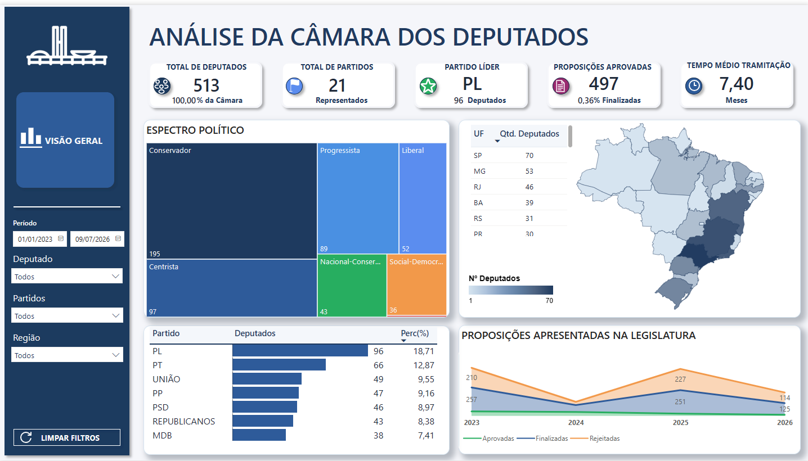

# Pipeline Lakehouse de Dados Abertos da Câmara dos Deputados


Projeto de Engenharia de Dados que implementa um pipeline Lakehouse ponta a ponta utilizando dados públicos da Câmara dos Deputados para disponibilizar uma base analítica consumida por Power BI.

A solução realiza ingestão via API, processamento distribuído com PySpark, armazenamento em Delta Lake, classificação textual com ML/NLP, modelagem dimensional em Star Schema e publicação de tabelas analíticas consumidas por um dashboard Power BI.

O projeto foi desenvolvido como portfólio para demonstrar boas práticas de Engenharia de Dados em uma arquitetura ponta a ponta.

---

## Sumário

- [Visão Geral](#visão-geral)
- [Resultados do Projeto](#resultados-do-projeto)
- [Problema de Negócio](#problema-de-negócio)
- [Arquitetura](#arquitetura)
- [Tecnologias Utilizadas](#tecnologias-utilizadas)
- [Dashboard Power BI](#dashboard-power-bi)
- [Competências Demonstradas](#competências-demonstradas)
- [Estrutura do Projeto](#estrutura-do-projeto)
- [Como Executar](#como-executar)
- [Documentação Técnica](#documentação-técnica)
- [Qualidade de Dados](#qualidade-de-dados)
- [Classificação ML/NLP](#classificação-mlnlp)
- [Modelo Dimensional](#modelo-dimensional)
- [Evoluções Futuras](#evoluções-futuras)
- [Fonte dos Dados](#fonte-dos-dados)
- [Status do Projeto](#status-do-projeto)

---

## Visão Geral

Este projeto simula um pipeline moderno de dados legislativos, com foco em boas práticas de Engenharia de Dados para portfólio.

O objetivo é demonstrar uma solução ponta a ponta, desde a coleta dos dados brutos da API pública até a disponibilização de tabelas analíticas para BI.

Principais entregas:

- ingestão de dados da API pública da Câmara dos Deputados;
- organização em camadas Bronze, Silver, Gold, Star Schema e Serving;
- processamento distribuído com PySpark;
- armazenamento em Delta Lake;
- classificação de proposições com regras, NLP e Machine Learning;
- modelo dimensional com tabelas fato e dimensão;
- validações de qualidade de dados;
- dashboard Power BI publicado;
- documentação técnica na pasta `docs/`.

---

## Resultados do Projeto

Ao final da execução do pipeline são entregues:

- Pipeline Lakehouse estruturado em arquitetura Medalhão;
- Ingestão automatizada da API da Câmara dos Deputados;
- Armazenamento em Delta Lake;
- Processamento distribuído com PySpark;
- Classificação textual utilizando regras, NLP e Machine Learning;
- Modelo dimensional em Star Schema;
- Publicação das tabelas para consumo analítico;
- Dashboard Power BI conectado às tabelas finais;
- Testes automatizados e validações de qualidade;
- Documentação técnica completa.

---

## Problema de Negócio

Os dados legislativos públicos são ricos, mas estão distribuídos em diferentes endpoints, com estruturas variadas e necessidade de tratamento antes de serem usados em análises.

Este projeto organiza esses dados para responder perguntas como:

- Quais temas legislativos aparecem com maior frequência?
- Quais deputados e partidos estão mais associados às proposições?
- Como as proposições tramitam ao longo do tempo?
- Como ocorrem votações e votos parlamentares?
- Quais órgãos participam dos eventos legislativos?
- Como transformar dados públicos brutos em tabelas analíticas para BI?

---

## Arquitetura

O projeto segue uma arquitetura lakehouse baseada no padrão medalhão.

```text
API Dados Abertos Câmara
        ↓
Bronze - Ingestão bruta
        ↓
Silver - Padronização e limpeza
        ↓
ML/NLP - Treinamento e classificação textual
        ↓
Gold - Enriquecimento analítico
        ↓
Star Schema - Fatos e dimensões
        ↓
Serving SQL - Publicação analítica
        ↓
Power BI - Visualização
```

Resumo das camadas:

| Camada | Responsabilidade |
|---|---|
| Bronze | Ingestão dos dados brutos da API, preservando a estrutura original. |
| Silver | Limpeza, padronização, tipagem e normalização dos dados. |
| ML/NLP | Treinamento dos modelos e inferência usada na camada Gold. |
| Gold | Enriquecimento analítico e aplicação de regras de negócio. |
| Star Schema | Organização dos dados em dimensões e fatos. |
| Serving | Publicação das tabelas finais para consumo no Power BI. |

Para detalhes completos, consulte a [documentação de arquitetura](docs/architecture.md).

---

## Tecnologias Utilizadas

| Categoria | Tecnologia / Conceito |
|---|---|
| Linguagem | Python 3.11+ |
| Processamento | PySpark |
| Armazenamento | Delta Lake |
| Arquitetura | Lakehouse, Arquitetura Medalhão |
| Modelagem | Star Schema, tabelas fato e dimensão |
| Machine Learning | scikit-learn |
| NLP | Regex, TF-IDF, classificação textual |
| MLOps | MLflow |
| BI | Power BI, DAX, Power Query |
| Qualidade | Data Quality Checks, Data Contracts |
| Observabilidade | Logs estruturados, watermarks |
| Fonte | API Dados Abertos Câmara dos Deputados |

---

## Dashboard Power BI

As tabelas finais do Star Schema foram utilizadas em um dashboard Power BI para exploração dos dados legislativos.



[Ver dashboard publicado](https://app.powerbi.com/view?r=eyJrIjoiZGIxYTA5MTMtZjIxNy00ZTlkLWJlMjEtMWZmODA1NTlhZWRmIiwidCI6Ijk2NDEzODNiLWQ0N2MtNDQyMy05OTA4LTU5MGYyYTRmNzgwZCJ9)

### Como este projeto se conecta ao Power BI

Após o processamento na arquitetura Lakehouse, as tabelas da camada Star Schema são publicadas na camada Serving para consumo analítico.

Esse modelo permite que o Power BI utilize tabelas fato e dimensão já tratadas, reduzindo transformações na camada de visualização e facilitando a criação de métricas em DAX.

O dashboard demonstra como os dados produzidos pelo pipeline podem ser utilizados para responder perguntas relacionadas à atividade legislativa, como distribuição de proposições, participação parlamentar, votações e tramitações.

Documentação complementar:

- [Documentação do Dashboard](docs/dashboard.md)
- [Modelo Star Schema](docs/star_schema.md)
- [Medidas DAX](docs/dax_measures.md)

---

## Competências Demonstradas

Este projeto demonstra conhecimentos práticos em Engenharia de Dados aplicados a uma solução analítica ponta a ponta.

### Engenharia de Dados

- Ingestão de dados via API REST;
- Processamento distribuído com PySpark;
- Arquitetura Lakehouse (Bronze, Silver, Gold, Star e Serving);
- Armazenamento em Delta Lake;
- Organização modular do pipeline;
- Configuração por ambiente (.env);
- Testes automatizados com Pytest;
- Padronização de código com Ruff;
- Integração contínua com GitHub Actions.

### Modelagem Analítica

- Modelagem dimensional (Star Schema);
- Construção de tabelas fato e dimensão;
- Publicação para consumo analítico;
- Dashboard Power BI.

### Machine Learning

- Classificação textual de proposições;
- Regex e dicionários temáticos;
- Modelo supervisionado;
- Registro de modelos com MLflow.

---

## Estrutura do Projeto

```text
projeto_api_dados_abertos_camara/
├── docs/
├── src/
│   ├── bronze/
│   ├── silver/
│   ├── gold/
│   ├── star/
│   ├── ml/
│   ├── serving/
│   ├── config/
│   └── utils/
├── tests/
├── .env.example
├── pyproject.toml
└── README.md
```

Principais módulos:

| Pasta | Função |
|---|---|
| `src/bronze/` | Ingestão dos dados brutos da API. |
| `src/silver/` | Transformações de limpeza e padronização. |
| `src/gold/` | Enriquecimentos analíticos e classificação. |
| `src/star/` | Construção de dimensões e fatos. |
| `src/ml/` | Treinamento, inferência e registro de modelos ML/NLP. |
| `src/serving/` | Publicação das tabelas finais. |
| `src/config/` | Configurações do projeto. |
| `src/utils/` | Funções reutilizáveis de API, storage, logs e qualidade. |
| `docs/` | Documentação técnica do projeto. |
| `tests/` | Testes automatizados. |

---

## Como Executar

Antes de executar, configure o ambiente com base no arquivo `.env.example`.

O arquivo `.env.example` contém exemplos das variáveis necessárias para execução. Para uso real, crie um arquivo `.env` local com os valores do seu ambiente. O arquivo `.env` não deve ser versionado.

### Execução local resumida

Clone o repositório:

```bash
git clone https://github.com/nadinne94/projeto_api_dados_abertos_camara.git
cd projeto_api_dados_abertos_camara
```

Crie o ambiente virtual:

```bash
python -m venv .venv
```

Ative o ambiente virtual:

```bash
# Windows
.venv\Scripts\activate

# Linux/Mac
source .venv/bin/activate
```

Instale as dependências:

```bash
pip install -e ".[dev]"
```

Crie o arquivo de configuração local:

```bash
cp .env.example .env
```

Execute os testes:

```bash
pytest
```

A execução deve respeitar a ordem das camadas:

```bash
python -m src.bronze.orchestration.runner
python -m src.silver.orchestration.runner
python -m src.ml.orchestration.training_runner
python -m src.gold.orchestration.runner
python -m src.star.orchestration.runner
python -m src.serving.publish_tables
```

Fluxo conceitual:

```text
Bronze → Silver → ML → Gold → Star Schema → Serving
```

Para instruções detalhadas, consulte o [Guia de Execução](docs/execution_guide.md).

---

## Documentação Técnica

A documentação detalhada do projeto está disponível na pasta `docs/`.

| Documento | Descrição |
|---|---|
| [Arquitetura do Projeto](docs/architecture.md) | Visão técnica da arquitetura lakehouse, camadas e componentes. |
| [Dashboard Power BI](docs/dashboard.md) | Explicação do dashboard, objetivo analítico e consumo das tabelas finais. |
| [Qualidade de Dados](docs/data_quality.md) | Validações, contratos e regras de qualidade aplicadas ao pipeline. |
| [Contratos de Dados](docs/data_contracts.md) | Regras de schema, chaves, qualidade e integridade das tabelas. |
| [Medidas DAX](docs/dax_measures.md) | Catálogo das medidas analíticas utilizadas ou recomendadas no Power BI. |
| [Guia de Execução](docs/execution_guide.md) | Passo a passo para executar Bronze, Silver, ML, Gold, Star e Serving. |
| [Linhagem dos Dados](docs/lineage.md) | Rastreamento do fluxo dos dados entre camadas. |
| [Classificação ML/NLP](docs/ml_nlp.md) | Estratégia de classificação textual de proposições. |
| [Evolução do Projeto](docs/project_evolution.md) | Limitações atuais, melhorias futuras e roadmap técnico. |
| [Modelo Star Schema](docs/star_schema.md) | Descrição das dimensões, fatos e modelo analítico. |

---

## Qualidade de Dados

O pipeline executa validações para garantir consistência dos dados produzidos, incluindo:

- datasets não vazios;
- chaves obrigatórias;
- unicidade;
- percentual máximo de nulos;
- domínio de valores;
- contratos de dados.

Mais detalhes estão disponíveis na documentação técnica.

- [Qualidade de Dados](docs/data_quality.md)
- [Contratos de Dados](docs/data_contracts.md)

---

## Classificação ML/NLP

A classificação das proposições combina:

- regras Regex;
- dicionários temáticos;
- modelo supervisionado;
- versionamento com MLflow;
- fallback para textos ambíguos.

Mais detalhes em [Classificação ML/NLP](docs/ml_nlp.md).

---

## Modelo Dimensional

A camada Star Schema organiza os dados em tabelas fato e dimensão para facilitar análises no Power BI.

Exemplos de tabelas analíticas:

| Tipo | Exemplos |
|---|---|
| Dimensões | `dim_tempo`, `dim_deputado`, `dim_partido`, `dim_proposicao`, `dim_orgao` |
| Fatos | `fato_proposicao`, `fato_autoria`, `fato_tramitacao`, `fato_votacao`, `fato_voto`, `fato_evento`, `fato_presenca` |

Mais detalhes em [Modelo Star Schema](docs/star_schema.md).

---

## Evoluções Futuras

Possíveis evoluções para aproximar o projeto de um ambiente produtivo:

### Engenharia de Dados

- Automatizar a orquestração com Databricks Workflows, Airflow, Prefect ou Dagster;
- Ampliar a cobertura de testes automatizados;
- Implementar monitoramento operacional do pipeline;
- Registrar histórico das métricas de qualidade de dados.

### Machine Learning

- Avaliar os modelos utilizando métricas como precisão, recall, F1-score e matriz de confusão;
- Expandir a base de treinamento;
- Experimentar modelos baseados em embeddings;
- Definir critérios de promoção de modelos no MLflow.

### Analytics

O modelo permite evoluir análises como:

- evolução temporal das proposições;
- participação parlamentar;
- comportamento de votação;
- distribuição por partidos;
- análise de temas legislativos;
- comparação entre legislaturas.

O roadmap completo está em [Evolução do Projeto](docs/project_evolution.md).

---

## Fonte dos Dados

Este projeto utiliza dados públicos disponibilizados pela Câmara dos Deputados.

- [API Dados Abertos da Câmara dos Deputados](https://dadosabertos.camara.leg.br/swagger/api.html)

---

## Status do Projeto

Projeto em versão de portfólio, com:
- pipeline ponta a ponta implementado,
- documentação técnica organizada,
- testes automatizados,
- integração contínua com GitHub Actions e
- dashboard Power BI publicado.

A versão atual demonstra competências práticas em:
- Engenharia de Dados,
- modelagem analítica,
- qualidade de dados,
- ML/NLP aplicado a texto e
- integração com BI.

Próximas melhorias estão documentadas em [Evolução do Projeto](docs/project_evolution.md).